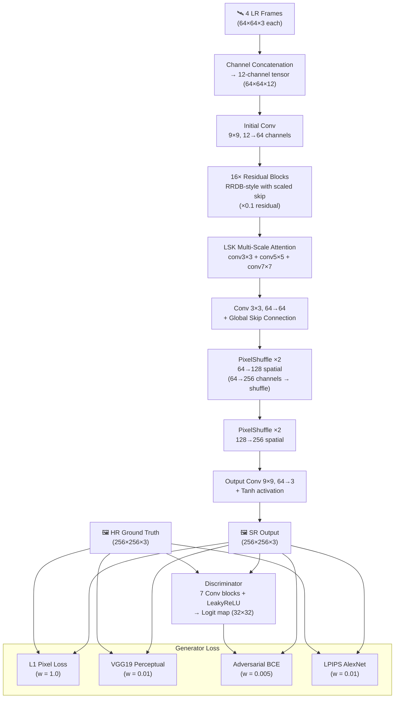

# TerraGAN Architecture

## Pipeline Diagram



## Component Descriptions

### Input Processing
- 4 LR satellite frames (64×64 RGB) selected from 16 candidates via pixel-wise similarity scoring
- Concatenated along the channel dimension → **12-channel input tensor**
- Normalised to [-1, 1]

### Generator

| Layer | In Channels | Out Channels | Kernel | Notes |
|-------|-------------|--------------|--------|-------|
| Initial Conv | 12 | 64 | 9×9 | Feature extraction entry |
| ResidualBlock ×16 | 64 | 64 | 3×3 | RRDB-style, scaled skip (×0.1) |
| LSK Attention | 64 | 64 | 3,5,7×3,5,7 | Multi-scale parallel convolutions |
| Mid Conv | 64 | 64 | 3×3 | + global skip from initial |
| PixelShuffle ×2 | 64 | 256→64 | 3×3 | 64×64 → 128×128 |
| PixelShuffle ×2 | 64 | 256→64 | 3×3 | 128×128 → 256×256 |
| Output Conv | 64 | 3 | 9×9 | + Tanh |

### LSK Attention
Three parallel depthwise convolutions (k=3, k=5, k=7) are summed with the input,
providing multi-scale receptive fields that selectively amplify texture-rich regions
in satellite imagery (vegetation edges, building boundaries, road networks).

### Discriminator (PatchGAN)
7 convolutional blocks with alternating strides produce a **32×32 logit map**
over patches of the 256×256 input. This encourages local texture fidelity
rather than global image-level judgement.

### Loss Function

```
L_total = 1.0  × L1(fake, hr)
        + 0.01 × L_VGG19(features(fake), features(hr))
        + 0.005 × L_BCE(D(fake), 1)
        + 0.01 × L_LPIPS(fake, hr)
```
